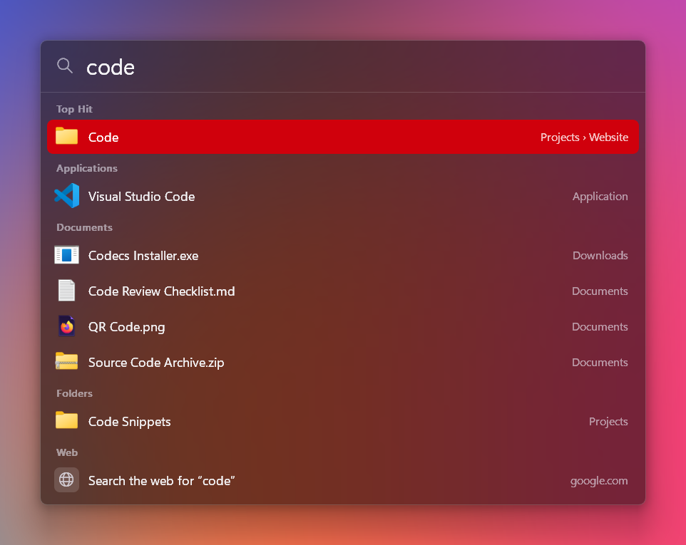
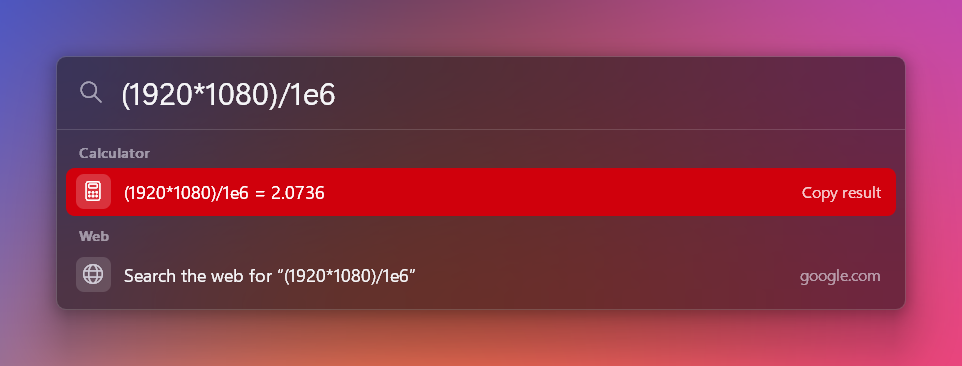

<p align="center">
  
</p>

<h1 align="center">Indicative</h1>

<p align="center">
  Spotlight for Windows. Press <b>Win+Space</b>, type, hit Enter.
</p>

<p align="center">
  <a href="https://github.com/ExplodingCB/indicative/releases/latest"></a>
  
  
  <a href="LICENSE"></a>
</p>

<p align="center">
  
</p>

## Features

- **Looks and works like macOS Spotlight.** A blurred acrylic panel, a Top Hit, and
  results grouped into Applications, Documents and Folders, with a web search fallback.
- **Finds everything in the Start menu.** That includes Store apps like Settings,
  Xbox and Calculator, with their real icons.
- **Searches your files.** Desktop, Documents, Downloads, Pictures, Music, Videos,
  plus any folders you add. Recently changed files rank higher.
- **Forgiving matching.** `vsc` finds Visual Studio Code, and `vis code` works too.
  Results you open often move up over time.
- **Inline calculator.** Type `2^10/4 + sqrt(16)` and press Enter to copy the result.
- **Tiny.** Native Win32 with no .NET, Electron or runtime. About 2.5 MB of memory
  while open and about 0.1 MB in Task Manager while idle.

<p align="center">
  
</p>

## Install

```powershell
winget install ExplodingCB.Indicative
```

Or download `indicative-setup-<version>.exe` from the
[latest release](https://github.com/ExplodingCB/indicative/releases/latest)
and run it. The installer is per-user by default (no admin prompt), adds a Start
menu entry, can start Indicative when you sign in, and can be removed from
**Settings > Apps**. A portable `indicative.exe` is attached to each release as well.

Requirements: 64-bit Windows 11. Windows 10 (1809+) should run without the blur but is untested.

> The executable and installer are not code-signed, so SmartScreen may show
> "Windows protected your PC" the first time. Choose **More info > Run anyway**.

## Usage

Press **Win+Space** anywhere, start typing, and press **Enter** to open the
selected result. Clicking outside the panel or pressing **Esc** closes it. The
panel remembers your last search, already selected, so you can retype or press
Enter to repeat it.

| Key | Action |
|---|---|
| Up / Down, Tab | Move the selection |
| Ctrl+Up / Ctrl+Down | Jump between sections |
| Enter | Open |
| Ctrl+Enter | Show the file or folder in Explorer |
| Ctrl+Shift+Enter | Run as administrator |
| Ctrl+C (nothing selected in the search box) | Copy the selected path or calculator result |
| Esc | Clear the search, then close |

Type `Indicative` for built-in commands: settings, rebuild the index, start at
login on or off, and quit.

Win+Space normally switches keyboard languages. Indicative takes it over, but
**Alt+Shift** still switches languages, or you can pick another shortcut.

## Settings

Settings are stored in `%APPDATA%\Indicative\config.ini` (or type
**Indicative Settings**). Restart Indicative after editing them.

| Key | Default | Meaning |
|---|---|---|
| `hotkey` | `win+space` | Modifiers `alt`, `ctrl`, `shift`, `win`; keys `space`, `a`-`z`, `0`-`9`, `f1`-`f24`, `` ` `` |
| `web_search` | Google | URL with `%s` where the query goes |
| `extra_roots` | empty | More folders to index, separated by `;` |
| `index_user_folders` | `true` | Set `false` to index only `extra_roots` |
| `max_files` | `60000` | Cap on indexed files and folders |
| `theme` | `auto` | `auto`, `dark` or `light` |
| `trim_memory` | `true` | Return memory to Windows a few seconds after the panel closes |

```powershell
indicative.exe               # start, or show the running copy
indicative.exe --install     # start at sign-in (HKCU Run key) and start now
indicative.exe --uninstall   # remove from sign-in and quit
indicative.exe --quit        # quit the running copy
```

---

# Technical details

## How it stays small

The resident process imports only kernel32, user32, gdi32, dwmapi and advapi32.

- **COM and shell32 never load in the resident process.** Listing apps and
  extracting icons needs the shell's COM APIs, which would cost several MB, so
  that runs in a short-lived child (`indicative.exe --apps`). Opening a result
  likewise goes through `indicative.exe --open`, which calls `ShellExecuteEx`
  and exits.
- **Icons are memory-mapped.** The child writes every app and file-type icon,
  already premultiplied, into one cache file. The launcher maps it read-only, so
  icon pixels are file-backed pages that load only when drawn and never count as
  private memory.
- **The file index is about 30 bytes per entry**: one WTF-8 name arena plus a
  12-byte record pointing at the parent folder. Full paths are rebuilt only for
  the handful of results on screen.
- **No window-sized bitmaps.** The panel is drawn in horizontal strips about 60 px
  tall. GDI renders text coverage masks only, and a small C compositor blends
  everything with correct alpha over the DWM acrylic backdrop. Strip buffers are
  freed when the panel closes.
- **No idle work.** The indexer thread sleeps on kernel change notifications. It
  rescans only after something changed *and* you open the panel, at background
  I/O priority.
- **Working-set trim.** A few seconds after the panel closes, Indicative compacts
  its heap and empties its working set. That is why Task Manager shows about
  0.1 MB while idle. Committed private memory stays around 3 MB, mostly the file
  index. Reopening the panel soft-faults those pages back in, which takes about
  a millisecond. Set `trim_memory = false` to keep them resident.

Measured on Windows 11 with about 60,000 indexed entries and 120 apps:

| State | Private working set (Task Manager) | Private bytes (commit) |
|---|---|---|
| Panel open | ~2.4 MB | ~3.6 MB |
| Closed (after trim) | ~0.1 MB | ~3.1 MB |

## Ranking

Matching lives in `csrc/fuzzy.c` and is tiered, so results stay predictable:
exact > prefix > word prefix > acronym > substring > fuzzy. Fuzzy matching applies
only to applications, and the first typed letter must start a word, so `code`
never matches *Recorder*. Multi-word queries match each word separately. Files
get a boost for recent changes and a small penalty for deep folders. Anything
you open gains a frequency and recency bonus, kept in
`%LOCALAPPDATA%\Indicative\history.txt`. Applications are favoured for the Top Hit.

## The Win+Space shortcut

Windows reserves Win+Space, so `RegisterHotKey` refuses it. For shortcuts that
include Win, Indicative installs a low-level keyboard hook on a dedicated
64 KB-stack thread. The hook swallows the combination and taps an unassigned
virtual key so that releasing Win doesn't open the Start menu. Other shortcuts
use plain `RegisterHotKey`.

## Code layout

| File | Language | Role |
|---|---|---|
| `src/main.rs` | Rust | Entry point: launcher, `--apps` / `--open` helpers, CLI flags |
| `src/ui.rs` | Rust | Window, DWM acrylic, text input, layout, painting, actions |
| `src/hotkey.rs` | Rust | Global shortcut (hook for Win+ combos) |
| `src/index.rs` | Rust | File/folder indexer and change watcher |
| `src/search.rs` | Rust | Builds the Top Hit / Applications / Documents / Folders sections |
| `src/apps.rs` | Rust | Memory-mapped app and icon cache reader |
| `src/history.rs`, `src/config.rs` | Rust | Launch history, settings |
| `csrc/fuzzy.c` | C | Matcher |
| `csrc/calc.c` | C | Calculator (recursive descent) |
| `csrc/raster.c` | C | Premultiplied-alpha compositor: rounded rects, text masks, icon scaling |
| `csrc/shellhelper.c` | C | COM app enumeration, icon extraction, `ShellExecuteEx` (child process only) |

## Building

The project targets x64 Windows with the Rust GNU toolchain and needs MinGW-w64
GCC for the C sources (it also supplies `windres` and `dlltool`):

```powershell
rustup toolchain install stable-x86_64-pc-windows-gnu
winget install BrechtSanders.WinLibs.POSIX.MSVCRT
cargo build --release
cargo test --release
```

`build.rs` finds a winget-installed WinLibs on its own. If `cargo build` reports
that `dlltool.exe` wasn't found, put the WinLibs `mingw64\bin` folder on `PATH`.
`scripts\package.ps1` does that for you and also builds the installer. The output
is `target\x86_64-pc-windows-gnu\release\indicative.exe`.

## Releasing

Pushing a `v*` tag runs `.github/workflows/release.yml`. It installs MinGW through
MSYS2, tests, builds, compiles the installer from `installer\indicative.iss`, and
publishes a GitHub release with the installer, the portable exe and
`SHA256SUMS.txt`. To do the same locally, install
[Inno Setup 6](https://jrsoftware.org/isinfo.php) and run:

```powershell
.\scripts\package.ps1 -Version 0.1.0
```

After a release is published, submit the new version to winget with
[wingetcreate](https://github.com/microsoft/winget-create):

```powershell
wingetcreate update ExplodingCB.Indicative --version 0.2.0 --urls https://github.com/ExplodingCB/indicative/releases/download/v0.2.0/indicative-setup-0.2.0.exe --submit
```

The first winget manifest lives in `winget/` for reference.
